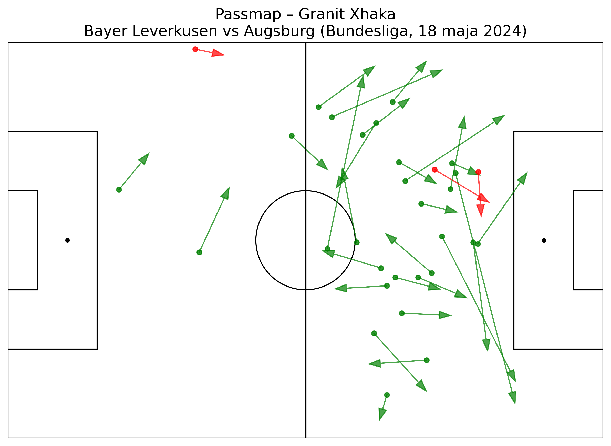

# passmap# Passmap – projekt analityczny

To repozytorium zawiera passmapy generowane na podstawie danych StatsBomb.

## 📌 Pierwsza grafika
**Granit Xhaka – Bayer Leverkusen vs Augsburg (18.05.2024)**  
Plik: `passmap_xhaka.png`

## 📁 Struktura repozytorium
- `passmap_xhaka.png` – pierwsza wygenerowana passmapa
- `README.md` – opis projektu

## 🎯 Cel projektu
Budowanie własnego warsztatu analitycznego, generowanie wizualizacji i dokumentowanie pracy skautingowej.
